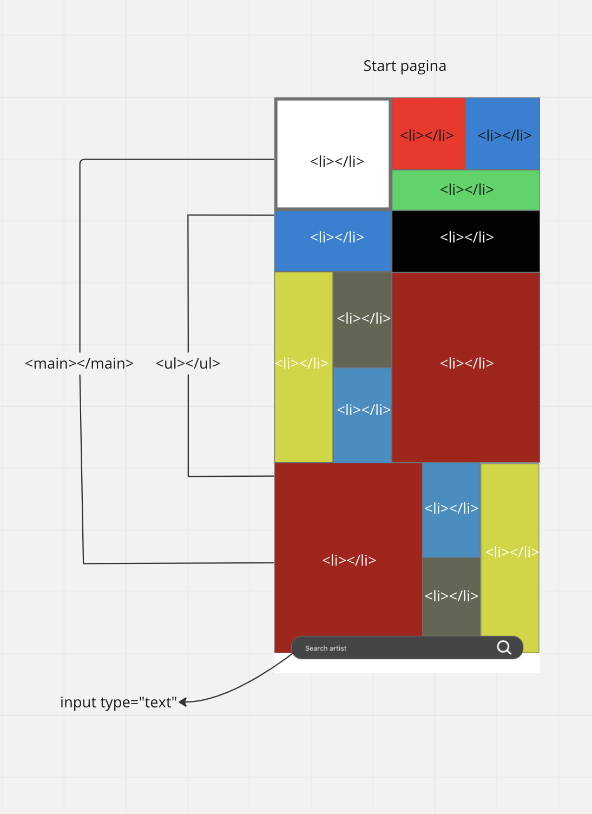
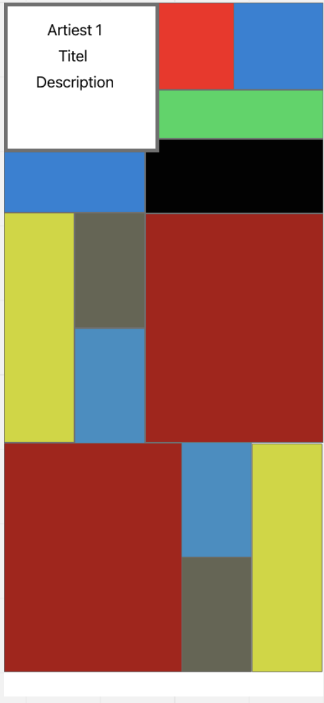
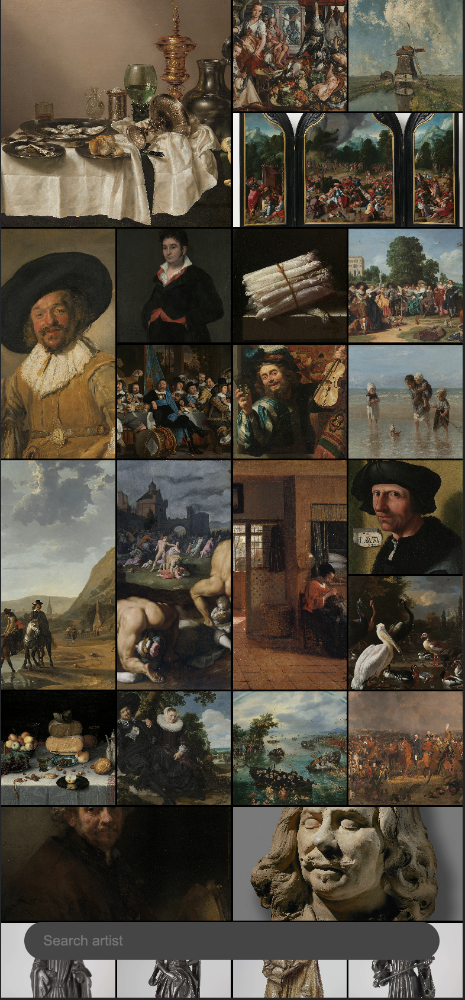
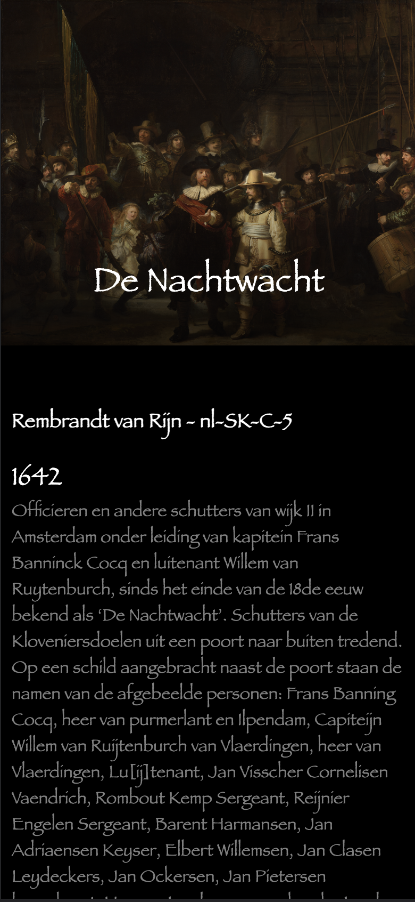
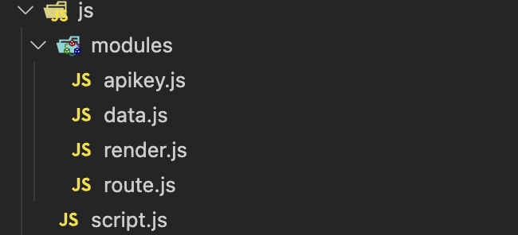
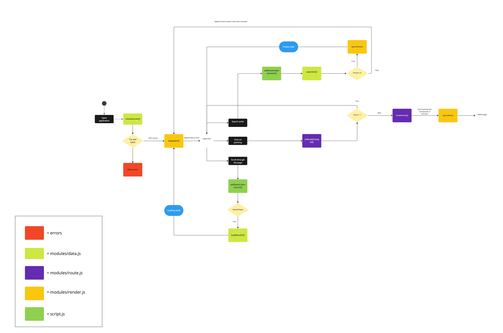

# Web App From Scratch 2022-2023

In this course you will learn to build a web application without frameworks or unnecessary libraries, but with vanilla HTML, CSS & JavaScript as much as possible. The end result is a modular, single page web app (SPA). Data will be retrieved from an external API, manipulated and finally shown in the UI of the App. You will learn to apply interface principles when building and testing the interface. With the gained knowledge you will be able to build interactive prototypes, based on a user story and real data. Also you will gain a better understanding of how API's, frameworks and libraries work.

## Assignment

1. [Single Page App](https://github.com/cmda-minor-web/web-app-from-scratch-2223/blob/master/course/week-2.md): Design and build a single page web app based on a User Story.

---

## Chosen user story

As an art lover, I want to be able to search and view art from the Rijksmuseum at home, so that I can still enjoy art during a lockdown [Rijksmuseum - RijksData API](https://data.rijksmuseum.nl/object-metadata/api/)


## Api investigation

### Rijksdata
 


Rijksmuseum data services provide access to object metadata, bibliographic data, controlled vocabularies and user generated content. These pages comprise the technical documentation of RijksData, also available are a general introduction, as well as the open data policy of the museum. In order to use the api you must require an API key by registering for a Rijksstudio account.
[Rijks data api](https://data.rijksmuseum.nl/)


## Best Practices

All work during this course will be tested against our [Best Practices for JavaScript](https://github.com/cmda-minor-web/best-practices/blob/master/javascript.md).

* Avoid global variables as much as possible
* code attribution/plagiarism
* OOP versus functional programming
* Using InnerHTML
* Cache elements in variables
* Split fetch url in variables
* Keep functions simple and focused
* Waterfall vs returning values
* Dry
* var,let or const
* for versus forEach
* Avoid inline css
* Loading external script files
* Properly handle loaded state
* object destructuring


## Week 1
### Design
Explore page             |  Details
:-------------------------:|:-------------------------:
  |  

I took inspiration from the Instagram explore page in order to make this design. In order to show the details of a certain painting I would create a small animation where the painting would flip and show further information. The application will also have a search where the user can browse through the catalogue.

### Fetching data
I used async/await method to fetch data. what is aysnc and await you might ask :open_mouth:

#### Async and await
Inside an async function, you can use the await keyword before a call to a function that returns a promise. This makes the code wait at that point until the promise is settled, at which point the fulfilled value of the promise is treated as a return value, or the rejected value is thrown.

**Example**
```
const fetchArt = async () => {
  const response = await fetch(`https://www.rijksmuseum.nl/api/nl/collection?key=${apiKey}&involvedMaker=Rembrandt+van+Rijn`);
  const data = await response.json();
  console.log(data);
}
```
Next I decided to append the data to the Html. I created a displayArt function to do that. I emptied the list container and used the forEach functionality to loop over each painting and insert them into the Html by using innerHTML. See code below.
```
const displayArt = (paintings) => {
    container.innerHTML = "";

    paintings.forEach(painting => {
        var liHtml = `<li></li>`;

        container.innerHTML += liHtml;
    });
}

```

Later I invoked the displayArt within the fetchArt scope and invoked the fetchArt in the global scope.
```
const fetchArt = async () => {
  const response = await fetch(`https://www.rijksmuseum.nl/api/nl/collection?key=${apiKey}&involvedMaker=Rembrandt+van+Rijn`);
  const data = await response.json();
  console.log(data);

  const paintings = data.artObjects;
  displayArt(paintings);
}

const displayArt = (paintings) => {
    container.innerHTML = "";

    paintings.forEach(painting => {
        var liHtml = `<li></li>`;

        container.innerHTML += liHtml;
    });
}

fetchArt();
```
For the UI I added a small hover on.

```
main ul li:hover{
    transform: scale(1.2);
    transition: 0.5s;
}

main ul li img{
    width: 100%;
    height: 100%;
    object-fit: cover;
}
```

### Wrap up week 1
How the application currently looks like.
<p style="text-align:center;">

</p>

## Week 2
This week I tried to focus on making the application more use-able for this I made an infinite scrolling function and a search function

### Infinite scrolling
Infinite scrolling is a popular user interface technique used to dynamically load content as the user scrolls down a page. This technique is often used to improve the performance of web pages that contain large amounts of data, such as search results, social media feeds, and image galleries.

The basic idea behind infinite scrolling is to continuously load new content as the user approaches the end of the current content. This is achieved by detecting when the user has scrolled to the bottom of the page, and then making an asynchronous request to the server to retrieve more data. The new data is then appended to the existing content, allowing the user to continue scrolling without interruption.

Here's an example of how to implement infinite scrolling in JavaScript:

```
window.addEventListener("scroll", () => {
  const endOfPage = window.innerHeight + window.scrollY >= document.body.offsetHeight;

  throttle(() => {

    if(endOfPage && !fired) {

      loadMoreArt();
      console.log("end of page");
      fired = true;
    }else if(!endOfPage){
      fired = false;
    }

  }, 1000);


});
```
In this example we used the scroll addeventlistener when a user scrolls. Then we check if the user has scrolled to the bottom of the page by comparing the sum of the viewport height and scroll position to the height of the entire document. If the user has reached the bottom of the page and `fired` is not true invoke the `loadMoreArt()` method and set `fired` to true.

The `loadMoreArt()` method is a simple function which loads the next set of data

```
const loadMoreArt = async () => {
  page++;
  const response = await fetch(`https://www.rijksmuseum.nl/api/nl/collection/?key=${apiKey}&p=${page}&ps=${limit}`);
  const data = await response.json();

  const morePaintings = data.artObjects;

  displayArt(morePaintings);
}
```

everytime this function runs increase the global variable `page` with one and load the next set of data.

### Search function
For the search function I created a form with an input type search. The `addEventListener` method in JavaScript is used to register an event handler function for a specified event on a DOM element. The submit event is fired when a form is submitted, either by clicking the submit button or by pressing the enter key while a form field has focus.

Here is an example how I handled it

```
form.addEventListener("submit", (e) => {
  e.preventDefault();

  const searchTerm = searchInput.value;
  searchArt(searchTerm);
});
```
The `searchTerm` variable is a global variable that checks what the user has typed in the input field. Next it gets passed as an argument to the `searchArt` method.

The `searchArt` method is yet again a simple function that uses the searchTerm the user has typed in and looks for paintings.

```
const searchArt = async (searchTerm) => {
  console.log(searchTerm);
  const response = await fetch(`https://www.rijksmuseum.nl/api/nl/collection/?key=${apiKey}&q=${searchTerm}&p=${page}&ps=10`);
  const data = await response.json();

  console.log(data);

}
```

### Wrap up week 2
Visually not much has changed from the application but I added a lot more functionality to the application to make it cleaner.

I ended up adding a throttle function to the infinite scrolling but it didn't work as intended so I ended up removing it.

Below for reference:

```
const throttle = (callback, time) => {

    if (throttleTimer) return;

    throttleTimer = true;

    setTimeout(() => {
      callback();
      throttleTimer = false;
    }, time);
}
```

## Week 3
This week I focussed on the routing of the application and the details page.

### Routing
In vanilla JavaScript, routing using only the hash portion of the URL can be achieved by leveraging the window.location.hash property and the window.onhashchange event.

The `window.onhashchange` event and its associated `addEventListener` method are used in web development to detect changes to the URL fragment identifier (the part of the URL that comes after the # symbol).

Here's an example implementation:

```
const onRouteChanged = () => {
  const hash = window.location.hash;

  console.log(hash)
  getDetails(hash);
};

window.addEventListener("hashchange", onRouteChanged);
```
I save the hash by putting it in the `hash` variable. Then I invoke the `getDetails` method and pass the hash as argument.

The `getDetails` method takes the the argument that has been passed and looks for the painting associated with the objectNumber.

```
const getDetails = async (objectNumber) => {
  var objectNumber = objectNumber.replace("#", "");
  const response = await fetch(`https://www.rijksmuseum.nl/api/nl/collection/${objectNumber}?key=${apiKey}`);
  const data = await response.json();


  const artDetails = data.artObject;
  appendMain(artDetails);
}
```

Within the `getDetails` scope I invoked another method called `appendmain`.

```
const appendMain = (artDetails) => {
  const main = document.querySelector("main");
  main.innerHTML = "";

  var html = `
    <figure>
      
      <figcaption>${artDetails.title}</figcaption>
    </figure>
    <h3>${artDetails.principalMaker} - ${artDetails.id}</h3>
    <section>
      <h2>${artDetails.dating.presentingDate}</h2>
      <p>${artDetails.description}</p>
      <p>${artDetails.subTitle}</p>
    </section>`;
  main.insertAdjacentHTML("beforeend", html);

  console.log(artDetails);
}
```

`appendMain` is a function which changes the entire UI. I start off by emptying the main and creating a template string. Then I use the `insertAdjacentHTML` method to append it to the main.

I ended up adding some styling to the details page.
See below:

```
main figure{
    height: 50vh;
    position: relative;
}

main h3{
    color: white;
    padding: 10px;
    font-family: fantasy;
}

main figure img{
    width: 100%;
    height: 100%;
    object-fit: cover;
}

main > section{
    padding: 10px;
    font-family: fantasy;
}

main > section p:nth-of-type(2){
    font-size: 1.5em;
    font-weight: 100;
    color: white;
}

main > section h2{
    color: white;
    font-size: 1.5em;
    font-weight: 100;
}

main > section p{
    color:gray;
}

main figure figcaption{
    position: absolute;
    bottom: 0;
    left: 0;
    width: 100%;
    height: 50%;
    background: linear-gradient(0deg, black, transparent);
    color: white;
    display: flex;
    justify-content: center;
    align-items: center;
    font-size: 32px;
    font-weight: 300;
    transition: 0.4s;
    font-family: 'Octarine';
    padding: 10px;
    font-family: fantasy;
} 
```

### Routing update
I was stuck on the routing but I ended up getting it fixed.

```
const checkHash = () => {
    console.log(window.location.hash);
    if(window.location.hash) { 
      onRouteChanged();
    }
  }
```

I created a simple `checkHash` method that checks whether there is a hash. If there is a hash invoke the `onRouteChanged` method.

In the `onRouteChanged` method function I created an if statement that checks if the hash is empty. If the hash is empty return back to index.html

```
    if(hash == ""){
      console.log("home");
      window.location = "index.html";
    }else{
      handleRouting(hash);
    }
```

### Wrap up week 3
<p style="text-align:center;">

</p>

## Week 4
This week I tried improving some functionality and refactor some code of the application.

### Optimization
First I looked at the search functionality and added a empty state if the user gets no results
See code below:

```
  const paintingsOfMaker = data.artObjects;

  if(paintingsOfMaker.length == 0){
    container.innerHTML = "";
    const section = document.querySelector(".empty-container");
    const main = document.querySelector("main");

    main.classList.add("flex");

    section.innerHTML = `
        <h2>Can't find artist with name '${searchTerm}'</h2>
        <p>Try searching for a different artist</p>
      `;
  }else{

    container.innerHTML = "";
    paintingsOfMaker.forEach(painting => {
      var liHtml = `
      <li class="loading">
        <a href="#${painting.objectNumber}">
          
        </a>
      </li>`;

      container.insertAdjacentHTML("beforeend", liHtml);
      const lastLi = container.lastElementChild;

      setTimeout(() => {
        lastLi.classList.remove("loading");
      }, 400);
    });
  }
```

I check is the search results is equal to 0. If it is equeal to 0 then empty the main and append to the section the empty state.

### Modules
JavaScript modules are a way to organize and encapsulate code into reusable units. They allow developers to create small, independent pieces of code that can be easily imported and used in other parts of the application. Modules also help to prevent naming collisions and keep the global namespace clean.

There are several ways to create and use JavaScript modules. One popular approach is to use the ES6 module syntax, which is supported by most modern browsers.

Here is an example of how to create and export a module:

```
export const initialFetchArt = async () => {

  const response = await fetch(`https://www.rijksmuseum.nl/api/nl/collection/?key=${apiKey}&p=${page}&ps=${limit}`);
  const data = await response.json();

  const paintings = data.artObjects;
  displayArt(paintings);

}
```

In this example, we define one function, `initialFetchArt`, and export it using the export keyword. This makes them available to other modules that import this module.

Here is an example of how to import and use the functions from the above module:

```
import { initialFetchArt } from "./modules/data.js";
```

I ended up doing this with most of my code and I was left with this.



## Activity diagram



## Rubric

Your efforts will be graded using a single point rubric (see below). You will have to pass the criterion (centre column) to pass the course. During the test you will be consulted and will be given feedback on things we think deficient and things we think are an improvement on the criterion.

| Deficiency | Criterion | Improvement |
|:--|:--|:--|
|  | *User Interface* - you design, build and test the user interface by applying interface design principles |  |
|  | *Code structure* - you write modular, consistent and efficient HTML, CSS and JavaScript code by applying structure and best practices. You manage state for the application and the UI |  |
|  | *Data management* - you understand how you can work with an external API using asynchronous code. You can retrieve data, manipulate and dynamically convert it to structured html |  |
|  | *Project* - your app is working and published on GitHub Pages. Your project is thoroughly documented in the `README.md` file in your repository.  |  |

<!-- Add a link to your live demo in Github Pages 🌐-->

<!-- ☝️ replace this description with a description of your own work -->

<!-- replace the code in the /docs folder with your own, so you can showcase your work with GitHub Pages 🌍 -->

<!-- Add a nice poster image here at the end of the week, showing off your shiny frontend 📸 -->

<!-- Maybe a table of contents here? 📚 -->

<!-- How about a section that describes how to install this project? 🤓 -->

<!-- ...but how does one use this project? What are its features 🤔 -->

<!-- What external data source is featured in your project and what are its properties 🌠 -->

<!-- Maybe a checklist of done stuff and stuff still on your wishlist? ✅ -->

<!-- How about a license here? 📜 (or is it a licence?) 🤷 -->
